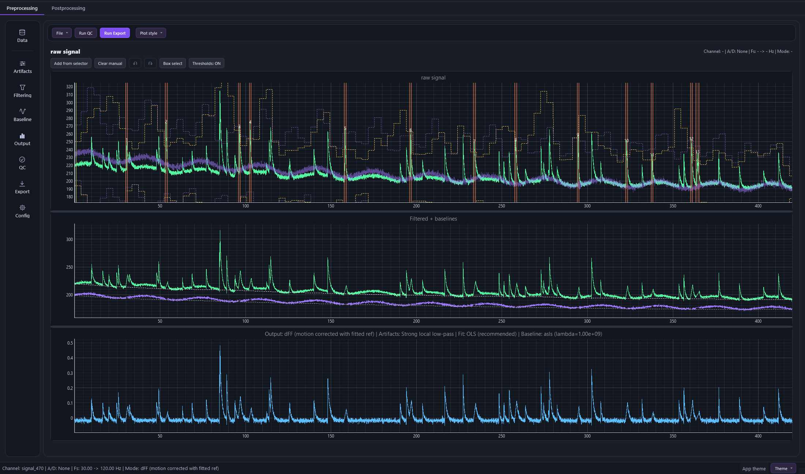
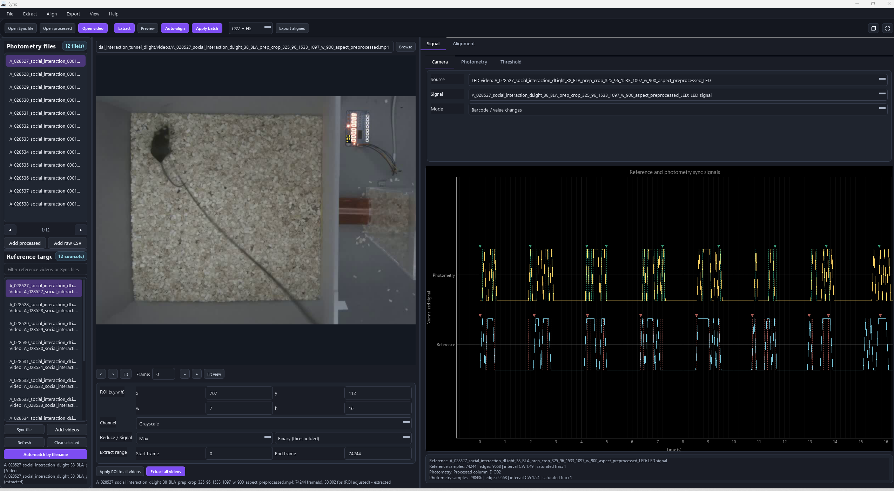
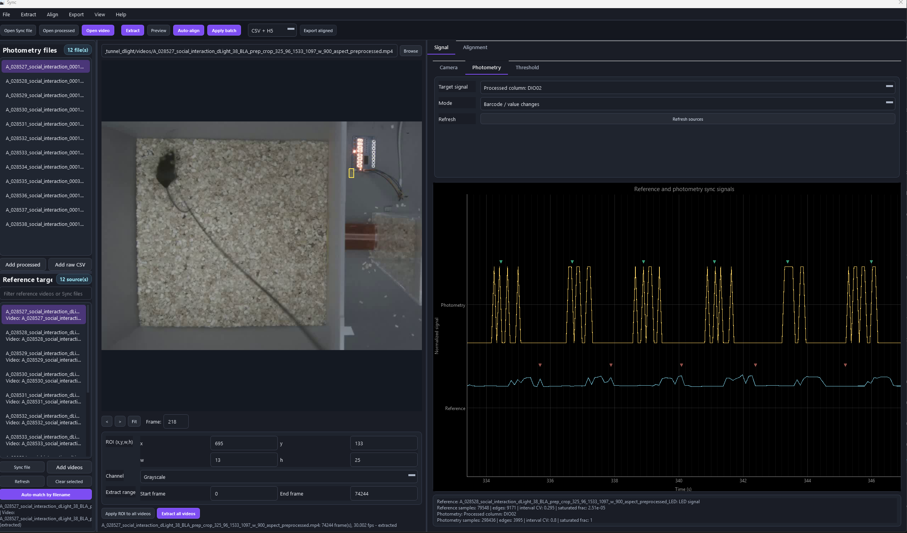

<p align="center">
  
</p>

<h1 align="center">pyBer</h1>

<p align="center">
  <b>Fiber photometry, from raw photons to publishable figures, without leaving the app.</b><br>
  Load it. Clean it. Align it. Model it. Export it. All in one polished desktop GUI.
</p>

<p align="center">
  
  
  
  
  
</p>

---

## Why pyBer?

Photometry analysis usually means duct-taping five scripts together and praying your
timestamps line up. pyBer puts the whole pipeline behind one interactive window:
artifact cleaning, motion correction, behavior and DIO alignment, sub-millisecond
camera-to-fiber synchronization, PSTHs, transient detection, and temporal modeling.
Interactive workflow on top, deterministic and testable processing code underneath.

> Built for neuroscientists who want to *see* every step, not just trust a black box.

---

## See it in action

### Preprocess raw traces into clean dFF
Raw signal, fitted-isosbestic baseline, and motion-corrected dFF, side by side, with
DIO markers laid right over the trace. Filtering, baseline, artifact handling, and
export all live in the rail on the left.



### Sync the camera to the fiber with an LED barcode
Point an ROI at the sync LED, extract the on/off train, and auto-align it to the
photometry DIO column. pyBer reads the barcode flashes with a duty-cycle-aware
threshold (Otsu when balanced, Triangle when sparse) so even faint LEDs line up.



### Cross-correlate and verify the alignment
Reference and photometry sync signals stacked on one timeline, with matched edges,
correlation, and agreement metrics so you know the alignment is real before you trust it.



---

## Quick install

Install [Miniforge](https://github.com/conda-forge/miniforge) or Anaconda first, then:

```powershell
cd path\to\pyBer
conda env create -f environment.yml
conda activate pyBer
Rscript -e "install.packages('fastFMM', repos='https://cloud.r-project.org')"
python .\pyBer\main.py
```

The `fastFMM` step is only needed for the FLMM temporal modeling panel. Everything
else works without it.

## Launch from VS Code

1. Open the repository folder in VS Code.
2. Select the interpreter from the `pyBer` conda environment.
3. Open `pyBer/main.py`.
4. Press Run, or:

```powershell
conda activate pyBer
python .\pyBer\main.py
```

If VS Code grabs the wrong Python, run `Python: Select Interpreter` and pick the
environment created from `environment.yml`.

---

## What you can do

- 🧹 **Preprocess** raw traces: filtering, resampling, baseline correction, motion
  correction, and artifact handling.
- 🔍 **Hunt artifacts** with interpolation, cutout, local low-pass filtering, or no-op.
- 🎥 **Synchronize** photometry time to camera or behavior time from shared TTL/barcode
  columns, and export a `time_aligned` column for downstream work.
- 📊 **Align to behavior** (DIO, behavior states, onsets, or transitions) and build
  individual or group PSTHs, heatmaps, and event-duration plots.
- ⚡ **Detect transients** and compare amplitudes with baseline-prominence normalized
  metrics.
- 🧠 **Model** with a continuous GLM or trial-level FLMM, then rank feature contribution
  with leave-one-feature-out summaries.
- 💾 **Export** processed CSV or HDF5 with selectable fields and metadata, ready for
  Python, MATLAB, R, or Prism.

---

## Documentation

The full user guide lives in [docs/index.md](docs/index.md): installation, first launch,
preprocessing, postprocessing, transient detection, temporal modeling, group workflows,
export, and troubleshooting.

## Repository layout

| Path | What it is |
|------|------------|
| `pyBer/main.py` | Application entry point and preprocessing window. |
| `pyBer/analysis_core.py` | Preprocessing and signal-processing backend. |
| `pyBer/gui_preprocessing.py` | Preprocessing panels. |
| `pyBer/gui_postprocessing.py` | Postprocessing, PSTH, sync, metrics, and export. |
| `pyBer/led_extract.py` | LED / barcode sync-signal extraction. |
| `pyBer/time_sync.py` | Edge detection, pairing, and cross-correlation alignment. |
| `pyBer/temporal_modeling.py` | GLM and FLMM modeling panel. |
| `environment.yml` | Conda environment for development and user installs. |
| `pyBer.spec` | PyInstaller build configuration. |

## Build the executable

From an activated environment:

```powershell
conda activate pyBer
python -m PyInstaller --noconfirm --clean pyBer.spec
```

The executable is written to `dist/pyBer.exe`.

## Notes

pyBer sets `PYTHONNOUSERSITE=1` so stale packages from the user Python folder cannot
shadow the conda environment. This keeps Qt, pyqtgraph, numpy, and rpy2 stable on Windows.

---

<p align="center"><sub>Made with 🧠 and a lot of dFF at the Bellone Lab.</sub></p>
