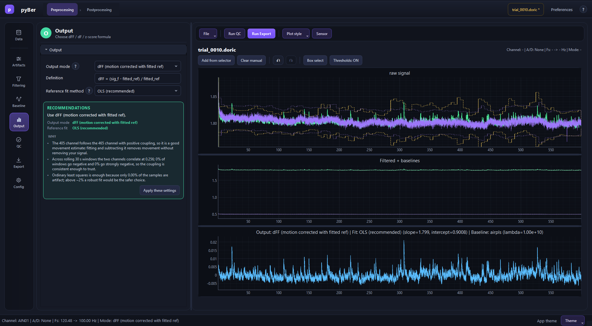
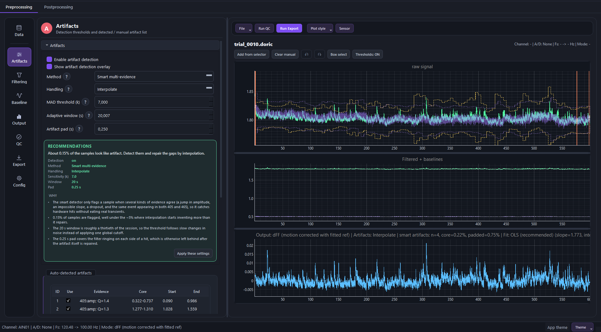
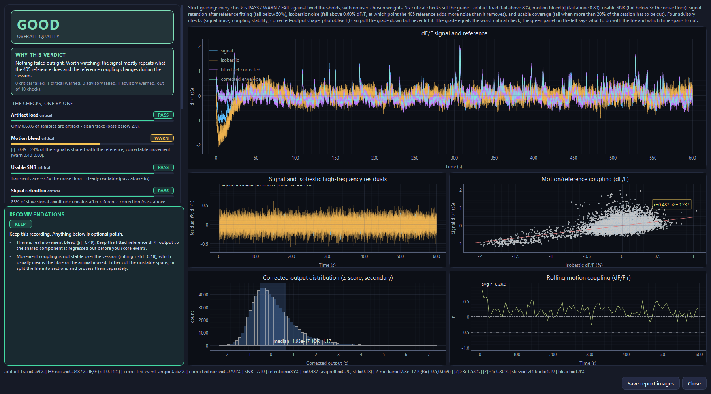
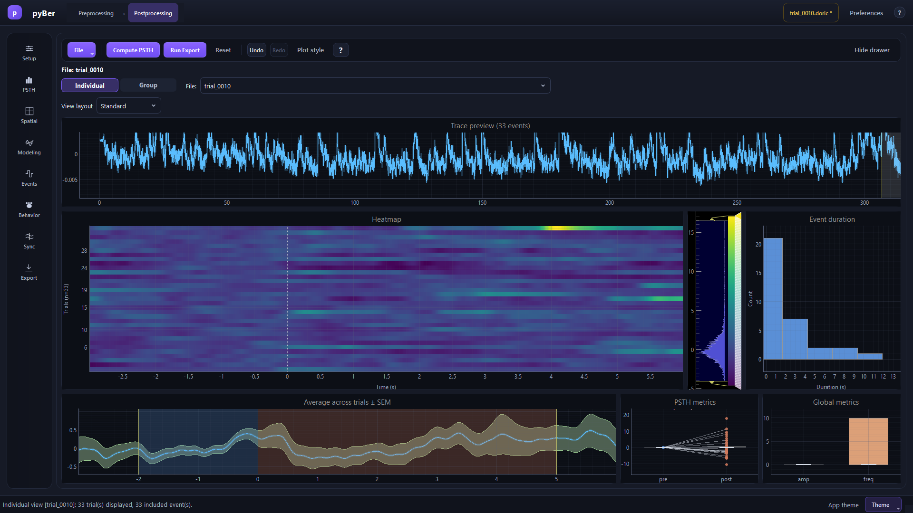
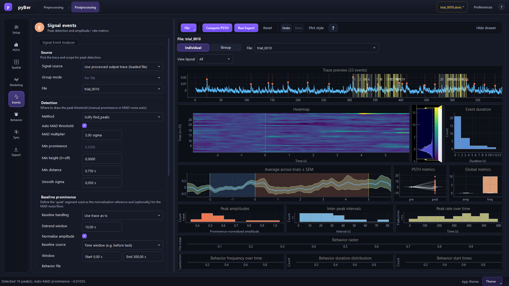
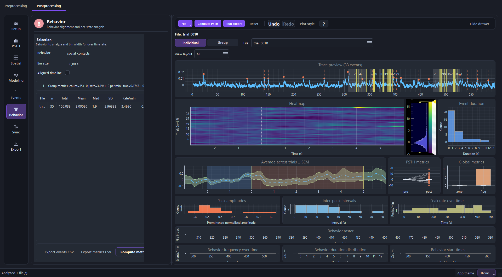
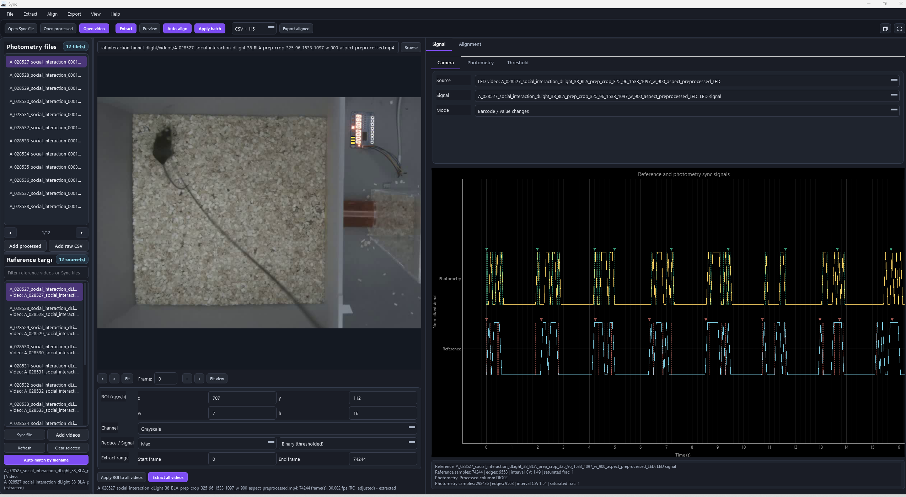
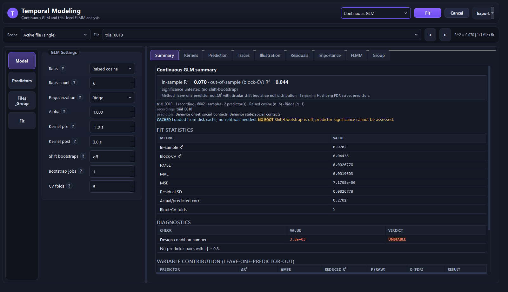
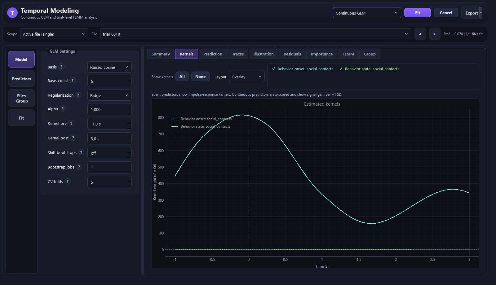

<p align="center">
  
</p>

<h1 align="center">pyBer</h1>

<p align="center">
  <strong>Interactive and batch fiber-photometry analysis, from raw acquisition to reviewable results.</strong><br>
  Inspect every processing decision in the desktop app, or run the same pipeline reproducibly from the CLI.
</p>

<p align="center">
  <a href="https://github.com/BelloneLab/pyBer/releases/tag/v0.46"></a>
  
  
  
  
</p>

<p align="center">
  <a href="https://github.com/BelloneLab/pyBer/releases/download/v0.46/pyBer-windows.exe"><strong>Download the Windows GUI</strong></a>
  &nbsp;|&nbsp;
  <a href="https://github.com/BelloneLab/pyBer/releases/download/v0.46/pyBer-cli-windows.exe"><strong>Download the Windows CLI</strong></a>
  &nbsp;|&nbsp;
  <a href="docs/index.md"><strong>Read the full guide</strong></a>
</p>

---

## One application, the complete analysis path

pyBer combines a visual workflow with a deterministic processing backend. The GUI is designed for inspection and parameter discovery. The CLI is designed for unattended cohorts and reproducibility. Both use the same loaders, recommendations, signal processing, metadata schema, and exports.

| Stage | Capabilities |
|---|---|
| Ingest | Current and legacy Doric HDF5 layouts, generic `.h5` / `.hdf5`, RWD fluorescence CSV exports, multiple channels, DIO/AOUT triggers, and recursive folder discovery. |
| Recommendations | Recording-aware settings from sampling rate, duration, artifact load, signal shape, 405/465 coupling, and the selected sensor's kinetics. Each recommendation explains what to use and why. |
| Preprocessing | Time windows and sections, resampling, low-pass filtering, Savitzky-Golay or moving-window smoothing, `asls` / `arpls` / `airpls` baselines, fitted-reference motion correction, and multiple dF/F and z-score outputs. |
| Artifact review | Smart multi-evidence detection, adaptive or global MAD modes, manual regions, interpolation, cutting, strong local low-pass repair, or annotation without modification. |
| Quality control | Strict PASS / WARN / FAIL checks for artifact burden, motion bleed, fitted-reference signal retention, corrected-output SNR, reference noise, coverage, signal noise, coupling stability, output shape, and photobleaching. Includes report images and batch flagging. |
| Event alignment | DIO onset or offset, behavior onset or offset, state transitions, continuous variables, individual recordings, and grouped animals. |
| PSTH and behavior | Trial heatmaps, mean with SEM, event durations, pre/post metrics, global summaries, behavior rasters, rates, durations, and start-time distributions. |
| Spatial analysis | Occupancy-normalized activity maps, trajectories, and velocity-aware views when tracking coordinates are available. |
| Signal events | SciPy peak detection, manual or MAD-noise thresholds, minimum height/prominence/distance, smoothing, baseline-prominence normalization, AUC, amplitude, inter-peak interval, and rate-over-time summaries. |
| Synchronization | Align photometry to an external signal or video ROI, detect shared TTL/barcode edges, estimate lag and drift, review matching quality, batch apply, and export `time_aligned`. |
| Temporal models | Continuous GLM with FIR, raised-cosine, or B-spline bases and ridge/lasso/OLS fits; trial-level FLMM through `fastFMM`; block cross-validation, diagnostics, kernels, prediction, residuals, importance, and group summaries. |
| Projects and export | Save/load postprocessing projects, autosave recovery, recent files, processed CSV and HDF5, metadata sidecars, tables, plots, model reports, and publication figures. |

## See the real pipeline

These captures were generated by pyBer itself from `trial_0010.doric` and its binary behavior table `trial_0010_with_time.csv`. The script in [`scripts/generate_readme_screenshots.py`](scripts/generate_readme_screenshots.py) makes the demo reproducible. No traces, metrics, or model results were mocked.

### Sensor-aware preprocessing with visible reasoning

The three synchronized plots show the raw signal and reference, filtered traces and baselines, and the selected output. The open drawer states the output formula, fit method, recommended values, and the evidence behind them.



### Artifact decisions are explicit and editable

The smart detector requires multiple forms of evidence before flagging a sample. Detected regions retain their evidence, core interval, padded repair interval, and enabled state. Manual regions can be added directly from the plot.



### Strict QC produces an actionable verdict

QC does not hide weak checks inside a weighted average. Critical and advisory checks are graded separately, the worst critical result controls the overall tier, and the recommendation card explains whether to keep, review, repair, or reject the recording.



### Behavior alignment, trial heatmaps, and population summaries

The supplied behavior file produces 33 social-contact onset trials. pyBer displays the full recording, event-aligned heatmap, average with SEM, event-duration distribution, and pre/post summaries together.



<table>
  <tr>
    <td width="50%"></td>
    <td width="50%"></td>
  </tr>
  <tr>
    <td align="center"><strong>Transient detection</strong><br>MAD-noise threshold, detected peaks, amplitudes, intervals, and rate.</td>
    <td align="center"><strong>Behavior analysis</strong><br>Per-file event count, time, duration, rate, raster, and distributions.</td>
  </tr>
</table>

### Video, TTL, and barcode synchronization

Select a video ROI or load an external reference signal, extract the shared pulse train, review edge matching and drift, then apply the alignment to the photometry timebase.



### Continuous GLM and trial-level FLMM

The modeling workbench consumes the current processed recordings, behavior variables, DIO channels, and PSTH events. This demo fits a ridge-regularized continuous GLM to the supplied social-contact onset and state predictors. The screenshot reports the real cross-validated fit, including an instability warning, rather than presenting an idealized result.





## Typical GUI workflow

1. Add a recording or a folder. Folder import searches through nested folders.
2. Select the photometry channel, optional DIO/AOUT trigger, time window, and sensor.
3. Review the recommendation cards. Apply all recommendations or accept them one section at a time.
4. Inspect artifacts, filtering, baseline, motion correction, and the final output on the linked plots.
5. Run strict QC. Repair or exclude flagged intervals before exporting.
6. Send processed recordings to Postprocessing.
7. Load behavior, timestamps, tracking, video, or an external sync signal as needed.
8. Compute individual or group PSTHs, spatial maps, behavior metrics, signal events, synchronization, or temporal models.
9. Save the project and export the exact tables, HDF5 bundles, reports, and figures needed downstream.

## Batch preprocessing from the CLI

Version 0.45 adds `pyber-cli` for one file, many files, or an entire directory tree. Recursive discovery is on by default.

```powershell
pyBer-cli-windows.exe "D:\photometry\cohort_1" `
  --sensor gcamp6f `
  --channel AIN01 `
  --trigger DIO02 `
  --output-dir "D:\photometry\cohort_1_processed"
```

From a source checkout, use the same interface through Python:

```powershell
conda activate pyBer
python .\pyBer\cli.py recording.doric `
  --sensor dlight12 `
  --format both `
  --set target_fs_hz=50 `
  --set lowpass_hz=10 `
  --set artifact_handling=Interpolate `
  --set baseline_lambda=1e9 `
  --set output_mode="dFF (motion corrected with fitted ref)"
```

Recommendations are computed first. A JSON parameter file is applied next, then repeatable `--set NAME=VALUE` arguments take final precedence.

| CLI option | Purpose |
|---|---|
| `inputs` | One or more files or folders. |
| `-o`, `--output-dir` | Destination. Defaults to `pyber_processed`. |
| `--sensor` | Sensor ID or exact sensor name. Use `unspecified` for generic assumptions. |
| `--channel` | Select one or more channels. Repeat or comma-separate the option. |
| `--trigger` | Include a DIO/AOUT trigger channel. |
| `--params-file` | JSON object containing `ProcessingParams` overrides. |
| `--set NAME=VALUE` | Override any processing field after recommendations. Repeatable. |
| `--format both|csv|h5` | Choose processed output formats. Defaults to both. |
| `--no-recursive` | Restrict folder inputs to their top level. |
| `--verbose` | Include tracebacks for failed recordings. |

Each recording-channel pair can produce:

```text
pyber_processed/
  recording__AIN01.csv
  recording__AIN01.h5
  recording__AIN01.pyber.json
  recording__AIN01_preprocessing_report.png
  recording__AIN01_preprocessing_report.json
  batch_summary.csv
  batch_summary.json
  flagged_recordings.csv
```

The flagged table collects processing failures, excessive artifact load, poor finite coverage, flat traces, low corrected SNR, recordings whose apparent activity disappears during reference fitting, high motion coupling, low-confidence recommendations, and sensor/trace warnings. It is a review queue, not a substitute for inspecting the report image.

## Supported data and outputs

| Kind | Native support |
|---|---|
| Raw photometry | Doric `.doric`, including current `LockInAOUT02/AIN01` and legacy `AIN01xAOUT02-LockIn/Values` layouts; compatible `.h5` / `.hdf5`; RWD fluorescence `.csv`. |
| Behavior | Binary state tables and timestamp/event tables from `.csv`, `.tsv`, `.xlsx`, and `.xls`, including onsets, offsets, transitions, and continuous variables. |
| Synchronization | Embedded DIO/AOUT, external timestamped signals, and video ROI intensity or barcode pulse trains. |
| Processed data | Self-describing CSV with `.pyber.json` sidecar and HDF5 with embedded metadata. |
| Reports | Preprocessing PNG, strict QC report images, batch summaries, flagged-recording tables, analysis CSVs, model tables, and publication figure exports. |

Brutally honest limitation: pyBer does not currently read TDT `.tev` or Neurophotometrics `.sev` files natively. The previous README claimed it did. Convert those acquisitions to a supported CSV or HDF5 layout first. The packaged v0.46 executables target Windows; source execution on other platforms is not part of the tested release path.

## What changed in v0.46

- Fixed compiled loading paths for supported Doric, CSV, and processed HDF5 inputs.
- Recalibrated QC around the fitted-reference corrected output, including corrected SNR and signal-retention checks that reject shared 405/465 contamination.
- Improved artifact repair with robust median anchors, short-gap merging, and higher-fidelity resampling across repaired spans.
- Fixed the Cut-mode plotting crash triggered by large artifact sets whose label windows contain only NaN samples.
- Refined artifact selection, linked plot navigation, and manual-region history behavior.
- Added a branded startup splash and refreshed the application theme, controls, recommendation cards, plots, and modeling workspace.
- Regenerated the documentation screenshots from the current application and expanded regression coverage for loading, QC, artifact repair, and overlays.

## Install from source

Install [Miniforge](https://github.com/conda-forge/miniforge) or Anaconda, then run:

```powershell
git clone https://github.com/BelloneLab/pyBer.git
cd pyBer
powershell -ExecutionPolicy Bypass -File .\scripts\create_pyber_env.ps1
conda activate pyBer
python .\pyBer\main.py
```

The helper creates or updates the `pyBer` environment, installs R, and installs the CRAN `fastFMM` package used by trial-level FLMM analysis. To repair only that R dependency:

```powershell
conda activate pyBer
Rscript .\scripts\install_fastfmm.R
```

If VS Code selects the wrong Python, run `Python: Select Interpreter` and choose the environment created from `environment.yml`.

## Reproducibility and output contract

- GUI and CLI call the same processing implementation in `analysis_core.py`.
- Exports record the pyBer version, source file, channel, sensor, acquisition metadata, effective parameters, output definition, artifact regions, and QC decision.
- CSV columns use stable names such as `time`, `time_aligned`, `raw_465`, `raw_405`, `baseline_465`, `baseline_405`, and the selected processed output.
- HDF5 files embed the same metadata used by the CSV sidecar.
- Postprocessing projects can be saved as HDF5 and recovered through autosave.
- The exact README demo can be regenerated with:

```powershell
conda activate pyBer
python .\scripts\generate_readme_screenshots.py `
  --doric "C:\path\to\trial_0010.doric" `
  --behavior "C:\path\to\trial_0010_with_time.csv"
```

## Documentation and development

The [full user guide](docs/index.md) covers installation, first launch, preprocessing, sensor selection, artifacts, QC, postprocessing, synchronization, transient detection, temporal modeling, group workflows, exports, and troubleshooting.

Run the test suite from the pinned environment:

```powershell
conda activate pyBer
python -m unittest discover -s tests -v
```

Build both Windows executables:

```powershell
conda activate pyBer
python -m PyInstaller --noconfirm --clean pyBer.spec
python -m PyInstaller --noconfirm --clean pyBer-cli.spec
```

| Path | Responsibility |
|---|---|
| `pyBer/main.py` | Application entry point, preprocessing shell, and strict QC. |
| `pyBer/analysis_core.py` | Loaders, recommendations, preprocessing, and export schema. |
| `pyBer/gui_preprocessing.py` | Interactive preprocessing panels and linked plots. |
| `pyBer/gui_postprocessing.py` | PSTH, behavior, spatial, event, sync, project, and export workflows. |
| `pyBer/temporal_modeling.py` | Continuous GLM and trial-level FLMM workbench. |
| `pyBer/led_extract.py` | Video ROI and barcode signal extraction. |
| `pyBer/time_sync.py` | Edge detection, pairing, lag, and drift estimation. |
| `pyBer/cli.py` | Recursive batch preprocessing CLI. |
| `tests/` | Unit, integration, GUI, legacy-format, CLI, and export regression tests. |

pyBer sets `PYTHONNOUSERSITE=1` so stale packages from the user Python directory cannot shadow the conda environment. This prevents common Windows conflicts between Qt, pyqtgraph, NumPy, and rpy2.

---

<p align="center"><sub>Developed for transparent fiber-photometry analysis at the Bellone Lab.</sub></p>
